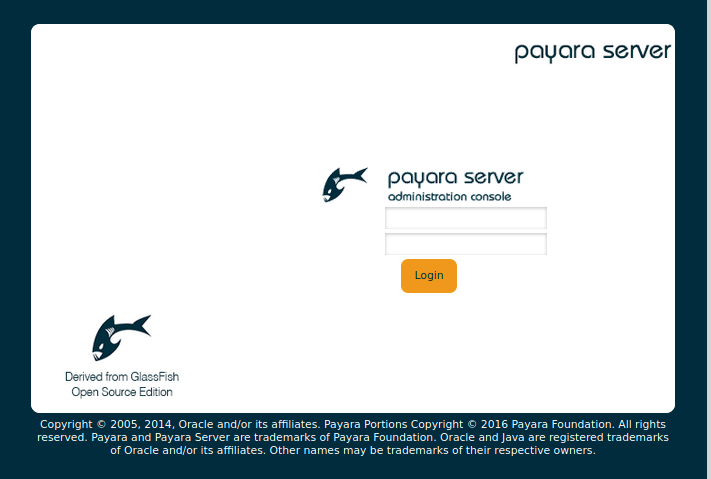

# Payara-env

Even if the most latest version payara-server-5.2020.3, one needs `java 8` in order to build the Payara from its github repository.
With OpenJDK 11, one can see error message such as

```bash
[ERROR] Failed to execute goal org.apache.maven.plugins:maven-compiler-plugin:3.8.0:compile (default-compile) on project asadmin-audit: Compilation failure
[ERROR] /home/jhlee/gitsrc/Payara-env/Payara-src/nucleus/payara-modules/asadmin-audit/src/main/java/fish/payara/audit/admin/SetAdminAuditServiceNotifierConfiguration.java:[168,67] incompatible types: org.jvnet.hk2.config.ConfigBeanProxy cannot be converted to fish.payara.nucleus.notification.configuration.Notifier
```

## Requirements

* JAVA 8

Amazon provides LTS OpenJDK at <https://aws.amazon.com/corretto>. It works well with Debian 10 without any issues.
In this repo, we use the corretto-8 version at <https://github.com/corretto/corretto-8/releases/tag/8.262.10.1>.

```bash
$ wget -c https://corretto.aws/downloads/resources/8.262.10.1/java-1.8.0-amazon-corretto-jdk_8.262.10-1_amd64.deb
$ sudo apt install ./java-1.8.0-amazon-corretto-jdk_8.262.10-1_amd64.deb
$ sudo update-alternative --config java
There are 3 choices for the alternative java (providing /usr/bin/java).

  Selection    Path                                                  Priority   Status
------------------------------------------------------------
* 0            /usr/lib/jvm/java-11-amazon-corretto/bin/java          11100008  auto mode
  1            /usr/lib/jvm/java-1.8.0-amazon-corretto/jre/bin/java   10800262  manual mode
  2            /usr/lib/jvm/java-11-amazon-corretto/bin/java          11100008  manual mode
  3            /usr/lib/jvm/java-11-openjdk-amd64/bin/java            1111      manual mode

Press <enter> to keep the current choice[*], or type selection number: 1
```

## Build

```bash
make init
make build
```

## Installation

```bash
Payara-env (master)$ make install

Payara-env (master)$ make exist
tree -aL 1 /opt/payara
/opt/payara
├── bin
├── glassfish
├── h2db
├── javadb
├── META-INF
├── mq
├── README.txt
└── .versions
```

## Run the Payra service

* systemd service

We can use all generic systemd service commands. One can start it by `systemctl start payara`.

```bash
Payara-env (master)$ systemctl start payara
Payara-env (master)$ systemctl status payara
● payara.service - payara Service
   Loaded: loaded (/etc/systemd/system/payara.service; enabled; vendor preset: enabled)
   Active: active (exited) since Mon 2020-07-20 13:54:36 PDT; 1min 48s ago
     Docs: https://docs.payara.fish/community/docs/5.192/README.html
  Process: 14130 ExecStart=/usr/bin/java -XX:+IgnoreUnrecognizedVMOptions -jar /opt/payara/glassfish/lib/client/appserver-cli.jar start-domain productio
 Main PID: 14130 (code=exited, status=0/SUCCESS)
    Tasks: 126 (limit: 4915)
   Memory: 1.6G
   CGroup: /system.slice/payara.service
           └─14147 /usr/lib/jvm/java-1.8.0-amazon-corretto/bin/java -cp /opt/payara/glassfish/modules/glassfish.jar -XX:+UnlockDiagnosticVMOptions -XX:M
           .....
```

* Web site

<http://localhost:4848/>

||
| :---: |
|**Figure 1** Payara Server Web Screenshot. |

## Rules

```bash
make vars
make sd_start
make sd_status
make uninstall
```
