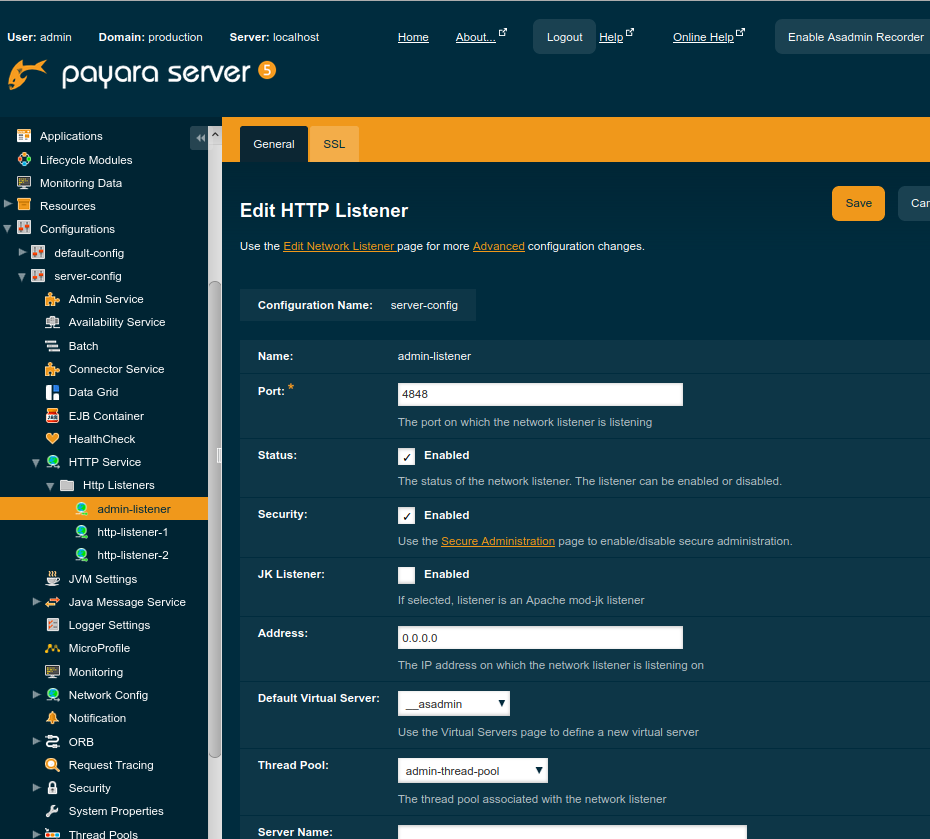

# Self-Certificate

Payara service has its own self-certificate with the default two alias as

* s1as : `http-listener-2` (8181)
* glassfish-instance : `admin-listener` (4848)

By default, without a web appliacation, one can access it through <http://localhost:4848>.

## Secure the admin web access

* Login with admin account

* Go <https://localhost:4848/common/appServer/securityAdmin.jsf> and hit `Enable Secure Admin`. Or go `Configurations > server-config > HTTP Service > admin-listener > Enabled`.

||
| :---: |
|**Figure 1** Edit HTTP Listener for Admin.|
